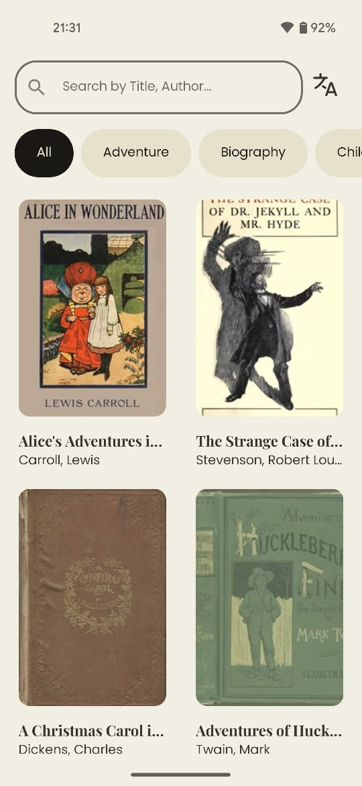
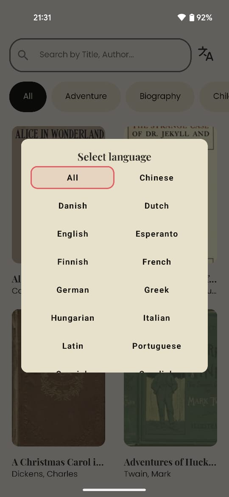
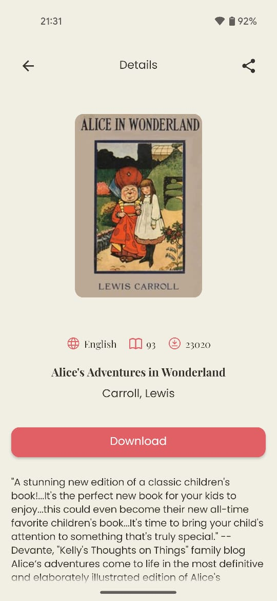

# Litarus

    
    
  

The project runs on the following setup:

- Android Studio Jellyfish | 2023.3.1 Patch 1
- Gradle Version 8.0
- Android Gradle Pluguin Version 8.1.1
- Tested on : Pixel 4a device, Emulator Pixel5 API 33

## Architecture
This app uses MVVM architecture and follows [Guide to app architecture](https://developer.android.com/topic/architecture).
